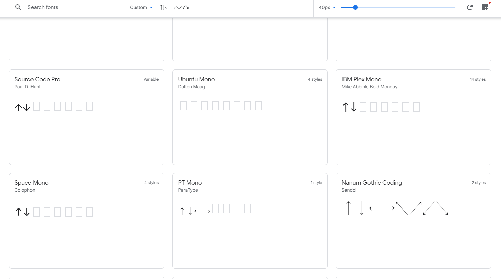
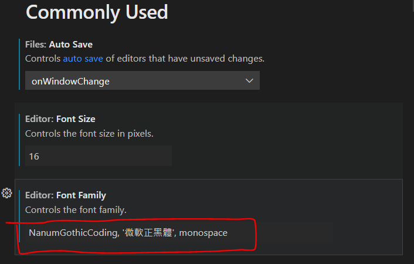
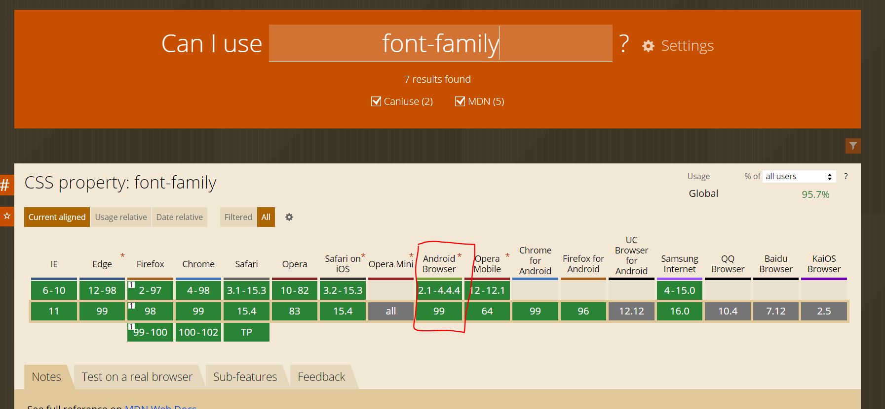

## 一致化 vscode 和網站的 font-family

上一篇文章用 `<pre>` 畫圖，結果發現手機的 `monospace` 顯示跟筆電的顯示結果不一樣(手機跑版了...)

結果是因為字型沒有提供對應的符號:

> 用 Google Fonts 搜尋 `↑↓←→↖↗↙↘` 只有 [Nanum Gothic Coding](https://fonts.google.com/specimen/Nanum+Gothic+Coding?category=Monospace&preview.text=%E2%86%91%E2%86%93%E2%86%90%E2%86%92%E2%86%96%E2%86%97%E2%86%99%E2%86%98&preview.text_type=custom) 顯示所有箭頭符號...

最後，為了讓寫 `.md` 檔看起來跟網頁一樣，下載了該字體。

接著設定 vscode 字體。

因為自己比較喜歡寬扁的字體，這款是細長型的，還在適應中。

這個字體的大於小於 `< >` 也是細長的，蠻特別的。

字體作者為 `Sandoll`，是一間韓國的字體公司。

[那個幫忙製作思源字體的公司——韓國字型公司 Sandoll by ⦿ 曼努 manzoo](https://medium.com/koom/profile-003-981476689afc)

如果想知道 Google Fonts 怎麼用，可以參考這篇:

[Web Font 的使用 by oxxo](https://www.oxxostudio.tw/articles/201406/css-web-font.html)

## 使用 chrome devtool debug Android 裝置

為了確保 `Android Browser`[註2] 可以正常顯示，用了 chrome 提供的功能。

操作步驟:

* 手機連接電腦後，手機選擇 `設定` > `進階人員選項` > 開啟 `USB 偵錯`。[註1]

* 電腦 Chrome 網址輸入 `chrome://inspect/#devices`

* inspect 要 debug 的網頁，就可以開始 debug 了。

---

更多詳情可參閱:

* [Remote debug Android devices by Kayce Basques](https://developer.chrome.com/docs/devtools/remote-debugging/)

* [Configure on-device developer options](https://developer.android.com/studio/debug/dev-options)

---

> 註1: xa2 sony 手機會自動開啟開發人員,如果你的手機沒自動開啟，可到 `設定` > `系統` > `關於手機` > `版本號碼` 點七下。這個技巧是在 [王紫楓](https://www.youtube.com/watch?v=8WuLsAFnOuc&list=PLhxdaTcUMi3lKmlyVVcWdeMsoyRPcyRLI) 我忘記哪支影片看到的，那時覺得他講話很像 godJJ 就把教學影片看完、還記到現在 xD

> 註2: 在 Can I use 網站上 `Android Browser` 是一個項目 (本以為會同桌機版 Chrome，實則為不同瀏覽器項目)

